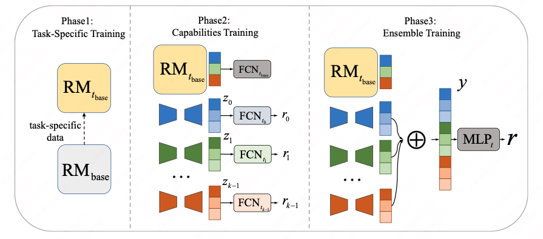

# DMoERM: Recipes of Mixture-of-Experts for Effective Reward Modeling



[ACL2024 Findings]This is the official repository of **DMoERM** for our paper [DMoERM: Recipes of Mixture-of-Experts for Effective Reward Modeling](https://arxiv.org/abs/2403.01197). The DMoERM has two layers of MoE: the outer MoE routes inputs to its corresponding task-specific inner MoE to avoid multi-task disturbance, and then the inner MoE uses multiple LoRA experts to evaluate inputs based on different capability points decomposed from the task and then aggregates them to get the final reward score.

# Setup

To promote research, we have released our dataset `mtmc-rlhf` at [huggingface](https://huggingface.co/datasets/quanshr/Ernie-rlhf).

Run the following command to download both our code and dataset:

```bash
git clone --recurse-submodules https://github.com/quanshr/DMoERM-v1.git
```

# Requirements

We run our code with `Python` 3.11.7 and `CUDA Toolkit` 11.8.
Run the following commands to build the environment with `Conda`.

```bash
conda create -n env python=3.11.7
conda activate env
conda install cudatoolkit=11.8
pip install -r requirements.txt
```

# Running

Our DMoERM uses `Qwen/Qwen-1_8B-Chat` as the base LM and can be trained and tested on a single Nvidia A100 80G GPU:

```
CUDA_VISIBLE_DEVICES=0 python main.py
```

# Citation

If our paper is useful for your study or you use our dataset in the research, please cite our paper as:

```
@misc{quan2024dmoerm,
      title={DMoERM: Recipes of Mixture-of-Experts for Effective Reward Modeling}, 
      author={Shanghaoran Quan},
      year={2024},
      eprint={2403.01197},
      archivePrefix={arXiv},
      primaryClass={cs.CL}
}
```
